

# 
 **CS 184: Computer Graphics and Imaging, Spring 2021** <!-- omit in toc -->

## 
 **Project 3: Path Tracing** <!-- omit in toc -->

## 
 **Frank Warren** 
 <!-- omit in toc -->

## **Contents** <!-- omit in toc -->

- [**Overview**](#overview)
- [**Part 1: Ray Generation and Scene Intersection**](#part-1-ray-generation-and-scene-intersection)
- [**Part 2: Bounding Volume Hierarchy**](#part-2-bounding-volume-hierarchy)
- [**Part 3: Direct Illumination**](#part-3-direct-illumination)
- [**Part 4: Global Illumination**](#part-4-global-illumination)
- [**Part 5: Adaptive Sampling**](#part-5-adaptive-sampling)

## **Overview**

The aim of this project is to implement a physics-based graphics renderer using a light pathtracing algorithm. Some of the ideas that will be used in this project include ray-scene intersection, acceleration structures, and physically based lighting and materials. The completed project will be able to generate realistic pictures.

## **Part 1: Ray Generation and Scene Intersection**

When we want to render something, it is given as a normalized `(x, y)` coordinate in the **image space**. Basically, this is just some pixel. Then, given the vertical and horizonal field of view angles `hFov` and `vFov`, we can translate the location of this pixel into the 3d **camera space**. This space is defined with a camera at the origin looking down the $-Z$ axis toward a plane (the **virtual sensor**) that's perpendicular to the $Z$ axis. The top right and bottom left of this plane (from the camera's point of view) is at the points $(tan(0.5 \cdot hFov), tan(0.5 \cdot vFov), -1)$ and $(-tan(0.5 \cdot hFov), -tan(0.5 \cdot vFov), -1)$ respectively. Finally, we can translate the point in the camera space into a point in the **world space** by using the rotation matrix `c2w`. The world space is pretty much the same idea as the camera space but now the camera isn't locked to the origin facing down the $-Z$ axis.  

After all of this is done, we are left with a point in the world space which we can use, along with the position of the camera, to generate a ray pointed at the point in world space from the camera.  

Now that we've implemented a way to generate rays, we want to determine if those rays intersect objects in a scene. To determine if a ray intersects some triangle, we can rely on the plane equation $p:(p-p') * N = 0$. The idea of determining if a point is on a plane by examining if it forms a line perpendicular to the normal of the plane with some known point the plane carries over exactly to finding intersections with triangles. Triangles are linear, so to figure out if a ray intersects a triangle, we use the same strategy but check to see if the resulting intersection point is inside the triangle (by comparing normals).  

There is an optimized algorithm for finding the time a ray intersects a triangle and the barycentric coordinates of the intersection known as the [Moller Trumbore Algorithm](https://en.wikipedia.org/wiki/M%C3%B6ller%E2%80%93Trumbore_intersection_algorithm). I implemented this algorithm in my implementation for triangle intersections.

| 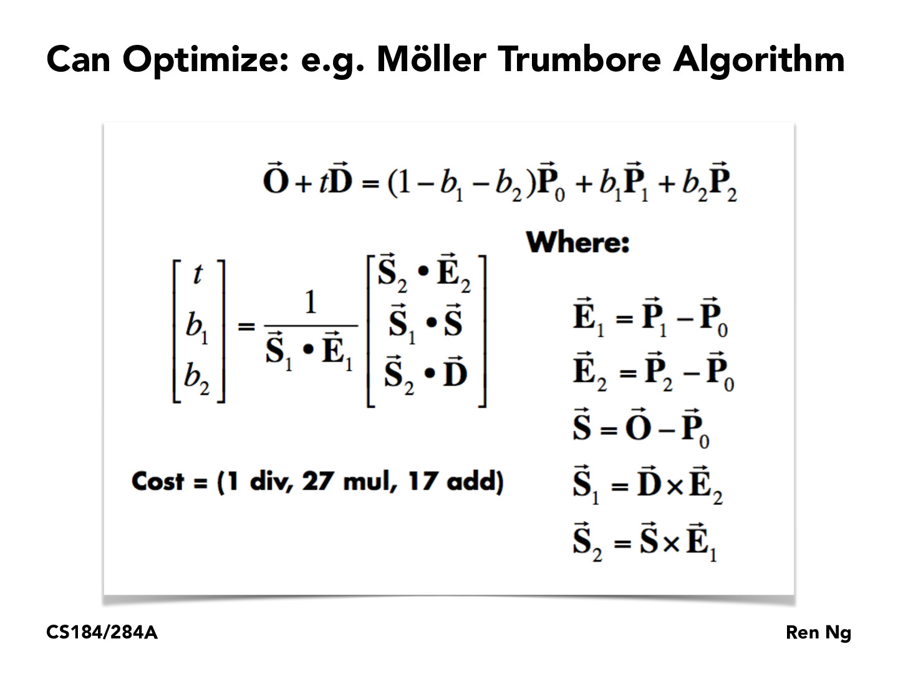 |
|:--:|
|Moller Trumbore Algorithm|

Once a time and barycentric coordinate pair is found, we must verify that the given time is nonnegative, the barycentric coordinates sum to 1, and the intersection is in the triangle.  

The process for sphere intersection is pretty much the same as triangle intersection. We take advantage of the general sphere defining formula to solve for $t$ values. There was no special algorithm used to implement sphere-ray intersection. Finding the time(s) a ray intersects a sphere basically boiled down to solving the quadratic formula.  

Here's some images with normal shading generated using these ray generation and scene intersection implementations:  

| | 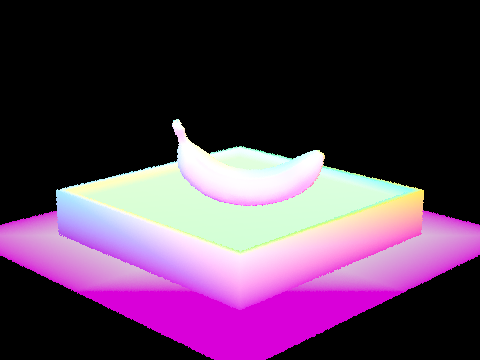 | 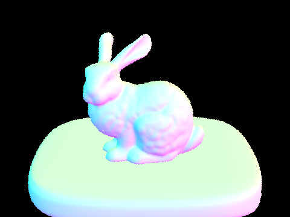 |
|:--:|:--:|:--:|
|  | | |

## **Part 2: Bounding Volume Hierarchy**

A [bounding volume hierarchy](https://en.wikipedia.org/wiki/Bounding_volume_hierarchy) (BVH) is a tree structure used to organized a set of geometric objects (things with length, volume, etc.). The basic idea of a bounding volume is to define boxes that contain objects in space such that we can efficiently find them. This is useful in ray tracing because everytime we cast a ray into a scene, we need to find out exactly what objects it will intersect, and with a BVH we can easily narrow down the objects by simply ignoring the ones we know *for sure* won't be intersected. In this project, the BVH is implemented as a binary tree. Each node points to a bounding box that contains a set of primitives (geometric objects). The left and right children of each nonleaf node points to nodes that represent the two partitions of the bounding box. The primitives in each node are tracked with two iterators: `start` and `end`.  

The bulk of the work when constructing a BVH comes from choosing and implementing a heuristic to split the objects in a scene in a way that minimizes the costs associated with ray tracing computations (i.e. the scene is split not too broadly or finely, along well chosen split points, etc). There are a number of metrics that can be considered in a heuristic such as the surface area of each primitive, the average location of each primitive, the number of primitives that lay on each side of a potential split plane, and others.  

In this project, the heuristic that was used to split a bounding box started by finding the axis for the box's largest dimension. Then, the split point along that dimesnion was computed as the average centroid (in that dimension) of the primitive's bounding boxes. After both of these steps, we essential have direction and a point and therefore we have a split plane.  

I actually spent an embarassingly long amount of time on this part because after implemented a BVH correctly and the methods for intersecting lines with bounding volumes, I forgot to change the provided code to loop ***only*** over primitives contained inside a bounding box that's intersected. Every time a ray intersected with a bounding box, I was testing intersection with every single primitive in the scene. Also, I was having a problem where my images would render flipped with some small amount of seemingly random primitives not being rendered. This was due to a short circuit in the expression `intersect(ray, intersect, left) || intersect(ray, intersect, right)` that was causing the right side to not be evaluated everytime there happened to be an intersect in the left bounding box, even though the right bounding box might contain an object that would've been intersected first.  

Anyways, here's some complex geometries that render much more efficiently after BVH was implemented.  

| 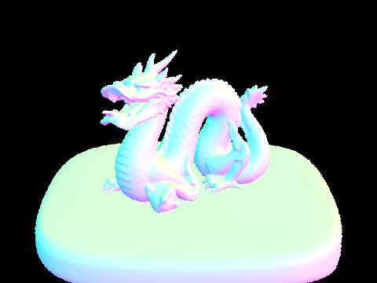| 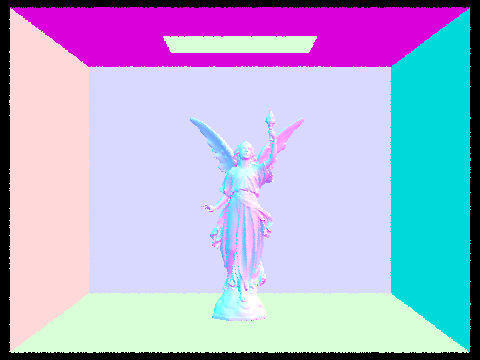 |  |
|:--:|:--:|:--:|
| Rendered in 0.0495s |  Rendered in 0.0619s | Rendered in 0.0753s |

Before implementing BVH, these scenes took at least half a minute each to render. I've never felt so powerful.

## **Part 3: Direct Illumination**

To simulate realistic lighting, we need to be able to simulate the flow of light from one place to another. This includes things like various types of reflection, sources and sinks of light, and so on. When trying to calculate the amount of light at various points in a scene, we use integrals. Integrating to find the amount of light flowing on, though, or from a sufrace can quickly become expensive. To avoid this, we estimate the value of the integral by points in the scene at random. In this part, there were two implementations of direct lighting.  

Uniform random sampling was the first implementation. In this, implementation, when we have a point on an object that we want to compute the light value of, we simply create samples uniformly at random in the form of rays from that point in random directions away from it (in the direction of the hemisphere defined by its surface normal) and check if light is coming from those directions. Once we have estimated how much light is falling on a point, we use that point's *bidirectional scattering distribution funtion* to figure out how much of it is going toward our eye/camera. Remember to normalize!

The second lighting estimation implementation was importance sampling. It is pretty much the same, but instead of randomly sampling rays from the intersection point toward a random direction in its hemisphere, we only sample from the light sources. This makes sense since we are trying to measure light in a scene. Why would we want to waste samples on things that don't provide light?

The main difference between the two direct illumination implementations is that uniform sampling was noiser than importance sampling. Here are some pictures rendered using both illumination implementations at different amounts of light rays and light sampling. I personally like the look of noise, it illicits feelings of nostolgia in me even though I'm too young to remember film cameras.
| | 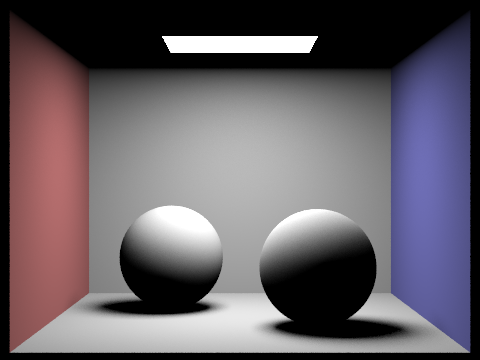 
|:--:|:--:|
| Uniform sampling: (32 samples/pixel,  32 light rays) |  Importance sampling (32 samples/pixel, 32 light rays) | 

| 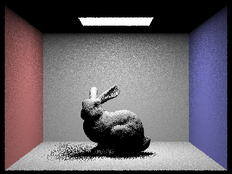|  
|:--:|:--:|
| 1 ray 1x/pixel importance sampling |  1 ray 4x/pixel importance sampling | 

| |  
|:--:|:--:|
| 1 ray 16x/pixel importance sampling |  1 ray 64x/pixel importance sampling | 

## **Part 4: Global Illumination**

- Pick one scene and compare rendered views with various sample-per-pixel rates, including at least 1, 2, 4, 8, 16, 64, and 1024. Use 4 light rays.
- You will probably want to use the instructional machines for the above renders in order to not burn up your own computer for hours.

When dealing with lighting, we have to also consider quantaties of light that don't originate from typical light sources. Some surfaces are more reflective than others. It's possible that a lightsource that's *behind* some object could still contribute to lighting it up by having its light reflected off of a surface in front of the object onto the object's surface. In this project, we have already implemented zero and one bounce (direct) illumination. Now, all we need to do is pretty much the same radiance calculations, but recrsively to measure the movement of light across several surfaces. To prevent infinite recursion, we randomly exit recursion at some probability less than 1. Just like the previous parts, we have to remember to scale the resulting light, this time also scaling by the probability of exiting recursion.  

Here are some examples of direct and indirect illumination.  

| | 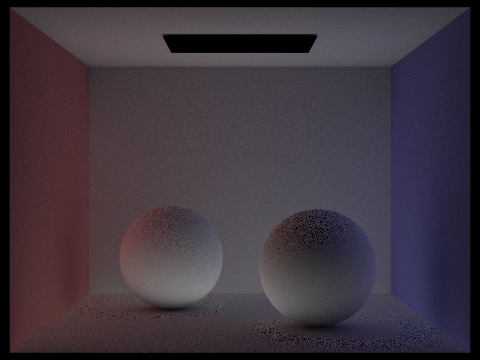 |
|:--:|:--:|
| Direct illumination (1024 samples per pixel)| Indirect illumination (1024 samples per pixel) |  

Here are some samples of scenes with various max ray depths. (Each image has 1024 samples per pixel). We can see that huge ray depths don't really add much to an image.

| 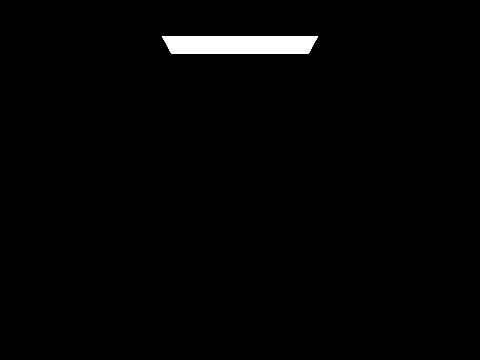|  |
|:--:|:--:|
| Depth = 0 | Depth = 1 |

| |  |
|:--:|:--:|
| Depth = 2 | Depth = 3 |

| 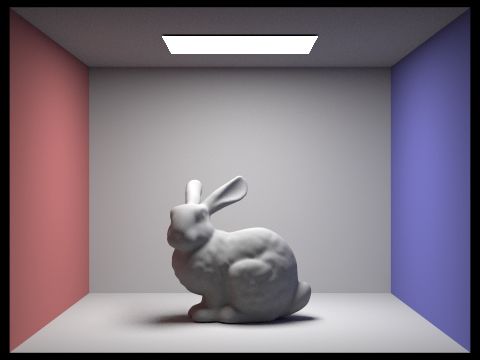|
|:--:|
| Depth = 100 |

Here's some spheres rendered with 4 light rays and various sample-per-pixel rates.  

| 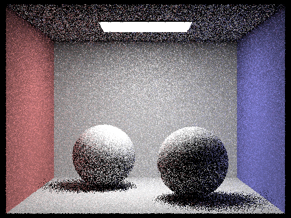| 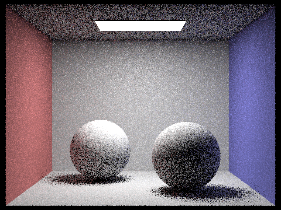 |
|:--:|:--:|
| 1 sample/pixel | 2 samples/pixel |

| |  |
|:--:|:--:|
| 4 samples/pixel | 8 samples/pixel |

| | 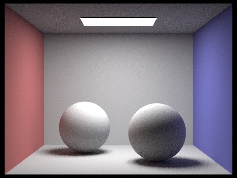 |
|:--:| :--: |
| 16 samples/pixel | 64 samples/pixel |

| |
| :--: |
| 1024 samples/pixel |

## **Part 5: Adaptive Sampling**

TODO:

- Walk through your implementation of the adaptive sampling.
- Pick one scene and render it with at least 2048 samples per pixel. Show a good sampling rate image with clearly visible differences in sampling rate over various regions and pixels. Include both your sample rate image, which shows your how your adaptive sampling changes depending on which parte of the image you are rendering, and your noise-free rendered result. Use 1 sample per light and at least 5 for max ray depth.

While Monte Carlo path tracing has been very effective in modeling the lighting of a scene, it results in large amounts of noise. To prevent this noise without having to just crank up the number of samples per pixel, we apply the same idea of importance sampling to deciding where to take more samples. In statistics, the variance of a set of data represents how "spread out" it is. When we take a set of samples fora pixel, we can masure the variance and decide whether or not we are confident in our findings. Based on this, some pixels will have more samples than other pixels.  

In this project, we sample in batches, and at each batch, we calculate a confidence interval $I = 1.96 \cdot \frac{\sigma}{\sqrt{n}}$. Once we reach a desired threshold $I \leq maxTolerance \cdot \mu$, then we can stop sampling for that pixel.  

ee